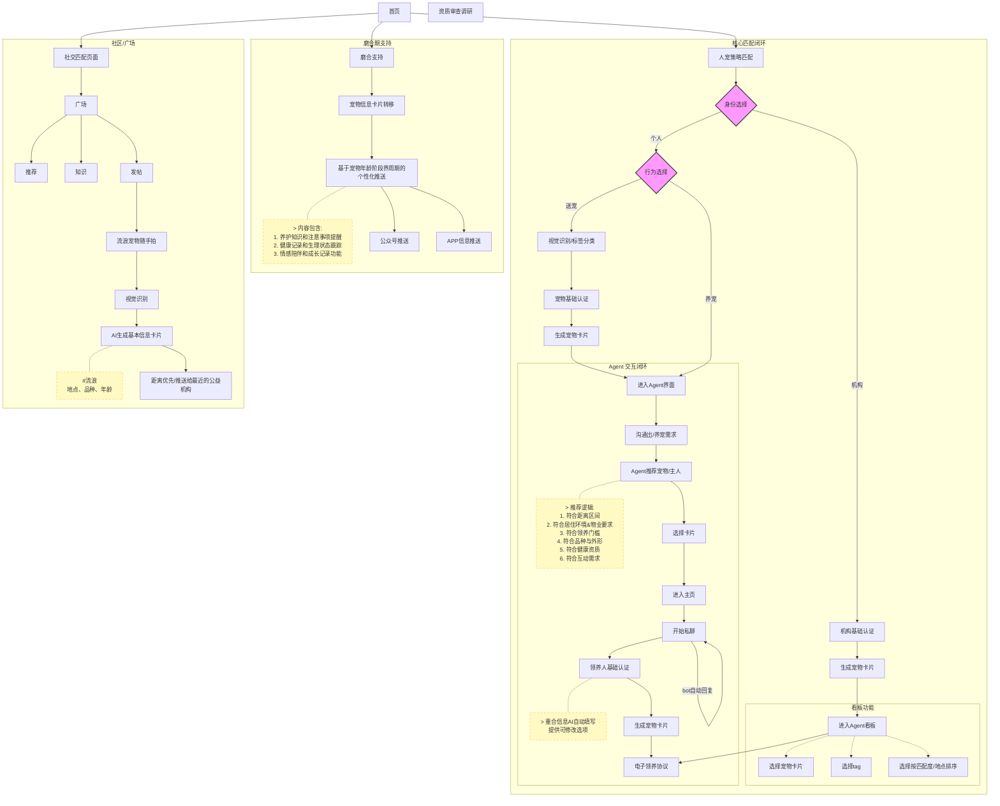

```mermaid
graph TD
    %% 根节点
    Home[首页] --> MatchStrategy[人宠策略匹配]
    Home --> Support[磨合支持]
    Home --> Community[社交匹配页面]

    %% ==========================================
    %% 分支 1: 人宠策略匹配 (Matching)
    %% ==========================================
    subgraph CoreMatching [核心匹配闭环]
        MatchStrategy --> IdentitySel{身份选择}
        
        %% 路径 A: 机构端
        IdentitySel -- 机构 --> InstVerify[机构基础认证]
        InstVerify --> InstGenCard[生成宠物卡片]
        InstGenCard --> AgentDash[进入Agent看板]
        
        subgraph AgentDashFeatures [看板功能]
            AgentDash -.-> SelectCard_Inst[选择宠物卡片]
            AgentDash -.-> SelectTag[选择tag]
            AgentDash -.-> SortLogic[选择按匹配度/地点排序]
        end
        
        AgentDash --> Agreement[电子领养协议]

        %% 路径 B: 个人端
        IdentitySel -- 个人 --> ActionSel{行为选择}
        
        %% B1: 送宠流程
        ActionSel -- 送宠 --> VisRec[视觉识别/标签分类]
        VisRec --> PetVerify[宠物基础认证]
        PetVerify --> UserGenCard[生成宠物卡片]
        UserGenCard --> AgentUI
        
        %% B2: 养宠流程
        ActionSel -- 养宠 --> AgentUI[进入Agent界面]

        %% Agent 核心交互区
        subgraph AgentInteraction [Agent 交互闭环]
            AgentUI --> CommNeeds[沟通出/养宠需求]
            CommNeeds --> RecSystem[Agent推荐宠物/主人]
            
            %% 推荐逻辑注解 (从原图文字提取)
            RecLogicNote[> 推荐逻辑:<br/>1. 符合距离区间<br/>2. 符合居住环境&物业要求<br/>3. 符合领养门槛<br/>4. 符合品种与外形<br/>5. 符合健康资质<br/>6. 符合互动需求]
            RecSystem -.- RecLogicNote

            RecSystem --> SelectCard_User[选择卡片]
            SelectCard_User --> ProfilePage[进入主页]
            ProfilePage --> StartChat[开始私聊]
            
            StartChat -- bot自动回复 --> StartChat
            StartChat --> AdopterVerify[领养人基础认证]
            
            %% 认证逻辑注解
            VerifyNote[> 重合信息AI自动填写<br/>提供可修改选项]
            AdopterVerify -.- VerifyNote

            AdopterVerify --> FinalCard[生成宠物卡片]
            FinalCard --> Agreement
        end
    end

    %% ==========================================
    %% 分支 2: 磨合支持 (Support)
    %% ==========================================
    subgraph LifecycleSupport [磨合期支持]
        Support --> Lifecycle[宠物信息卡片转移]
        Lifecycle --> PushEngine[基于宠物年龄阶段界周期的个性化推送]
        
        %% 推送内容注解
        PushContent[> 内容包含:<br/>1. 养护知识和注意事项提醒<br/>2. 健康记录和生理状态跟踪<br/>3. 情感陪伴和成长记录功能]
        PushEngine -.- PushContent

        PushEngine --> Channel1[公众号推送]
        PushEngine --> Channel2[APP信息推送]
    end

    %% ==========================================
    %% 分支 3: 社区广场 (Community)
    %% ==========================================
    subgraph SocialCommunity [社区/广场]
        Community --> Square[广场]
        Square --> TabRec[推荐]
        Square --> TabKnow[知识]
        Square --> TabPost[发帖]
        
        %% 流浪动物救助功能
        TabPost --> StraySnap[流浪宠物随手拍]
        StraySnap --> VisRec2[视觉识别]
        VisRec2 --> AIGenInfo[AI生成基本信息卡片]
        
        %% 自动提取标签
        Tags[#流浪<br/>地点、品种、年龄]
        AIGenInfo -.- Tags

        AIGenInfo --> OrgPush[距离优先/推送给最近的公益机构]
    end

    %% 孤立节点 (原图中独立存在的节点)
    ReviewSurvey[资质审查调研]

    %% 样式定义
    classDef decision fill:#f9f,stroke:#333,stroke-width:2px;
    classDef process fill:#e1f5fe,stroke:#01579b,stroke-width:2px;
    classDef note fill:#fff9c4,stroke:#fbc02d,stroke-width:1px,stroke-dasharray: 5 5;

    class IdentitySel,ActionSel decision;
    class RecLogicNote,VerifyNote,PushContent,Tags note;
```